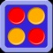
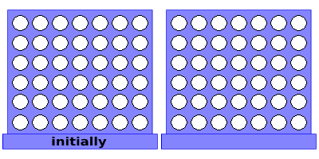

<div align="center">
  <a href="https://github.com/p3titcr0c0/IA_Connect_Four/">
    
  </a>
  <h3 align="center">IA_Connect_Four</h3>
  <h4 align="center">AI for solving a power 4 in which the current player does not see the opponent's moves</h4>
</div>

## This project aims to implement and attempt to solve a Secret variant of Connect 4
*Each player sees his own tokens, but not his opponents, until one of his tokens is stacked on top .*
<table>
<tr>
<td>
<a href="#banner"></a>
<br>
  <h3 align="center"><ins>J1 facing J2, with J1 sigh</ins></h3>
    <p align="center">J1 has red pawns</p>
    <p align="center">J2 has yellow pawns</p>
    <p align="center">From J1 point of view each gray box is a box in which the enemy could place a token</p>

</td>
</tr>
</table>
````
```
Look! You can see my backticks.
```
````

## Readme in creation
